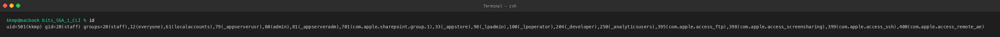
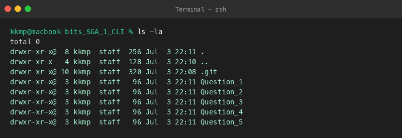
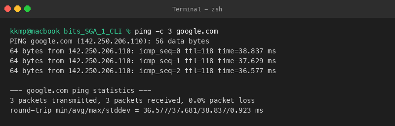

# Question 1: Linux Environment Verification

This directory contains the verification of my local Linux environment and user account details.

## Files Created
- [Environment_Report.txt](file:///Users/kkmp/Desktop/bits/bits_SGA_1_CLI/Question_1/Environment_Report.txt): Summary of the verified user details, shell, workspace files, and network status.

---

## Executed Commands, Outputs, and Explanations

### 1. Account Details (`id`)
**Command:**
```bash
id
```

**Output:**
```text
uid=501(kkmp) gid=20(staff) groups=20(staff),12(everyone),61(localaccounts),79(_appserverusr),80(admin),81(_appserveradm),701(com.apple.sharepoint.group.1),33(_appstore),98(_lpadmin),100(_lpoperator),204(_developer),250(_analyticsusers),395(com.apple.access_ftp),398(com.apple.access_screensharing),399(com.apple.access_ssh),400(com.apple.access_remote_ae)
```

**Explanation:**
Ran `id` to check user account details. My user is `kkmp` (uid 501), my main group is `staff`, and I also have admin access.

**Screenshot:**


---

### 2. Current Shell (`echo $SHELL`)
**Command:**
```bash
echo $SHELL
```

**Output:**
```text
/bin/zsh
```

**Explanation:**
Checked the active shell by printing the `$SHELL` environment variable. The system is using `/bin/zsh`.

**Screenshot:**


---

### 3. Current Working Directory (`pwd`)
**Command:**
```bash
pwd
```

**Output:**
```text
/Users/kkmp/Desktop/bits/bits_SGA_1_CLI
```

**Explanation:**
Printed the current working directory to confirm the path. I'm working under `/Users/kkmp/Desktop/bits/bits_SGA_1_CLI`.

**Screenshot:**


---

### 4. File and Directory Listing (`ls -la`)
**Command:**
```bash
ls -la
```

**Output:**
```text
total 0
drwxr-xr-x@  8 kkmp  staff  256 Jul  3 22:11 .
drwxr-xr-x   4 kkmp  staff  128 Jul  3 22:10 ..
drwxr-xr-x@ 10 kkmp  staff  320 Jul  3 22:08 .git
drwxr-xr-x@  3 kkmp  staff   96 Jul  3 22:11 Question_1
drwxr-xr-x@  3 kkmp  staff   96 Jul  3 22:11 Question_2
drwxr-xr-x@  3 kkmp  staff   96 Jul  3 22:11 Question_3
drwxr-xr-x@  3 kkmp  staff   96 Jul  3 22:11 Question_4
drwxr-xr-x@  3 kkmp  staff   96 Jul  3 22:11 Question_5
```

**Explanation:**
Listed all files and folders in the workspace, including hidden files. This shows the directories for all five questions.

**Screenshot:**


---

### 5. Network Connectivity (`ping -c 3 google.com`)
**Command:**
```bash
ping -c 3 google.com
```

**Output:**
```text
PING google.com (142.250.206.110): 56 data bytes
64 bytes from 142.250.206.110: icmp_seq=0 ttl=118 time=38.837 ms
64 bytes from 142.250.206.110: icmp_seq=1 ttl=118 time=37.629 ms
64 bytes from 142.250.206.110: icmp_seq=2 ttl=118 time=36.577 ms

--- google.com ping statistics ---
3 packets transmitted, 3 packets received, 0.0% packet loss
round-trip min/avg/max/stddev = 36.577/37.681/38.837/0.923 ms
```

**Explanation:**
Pinged google.com with 3 packets to verify the network connection. Got a 0% packet loss, which confirms the internet is connected.

**Screenshot:**

