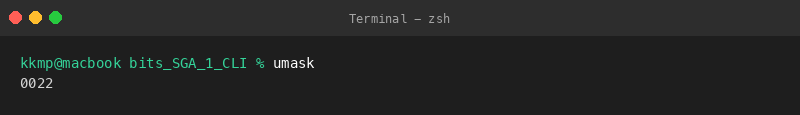
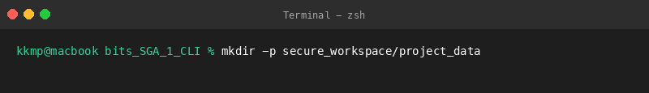
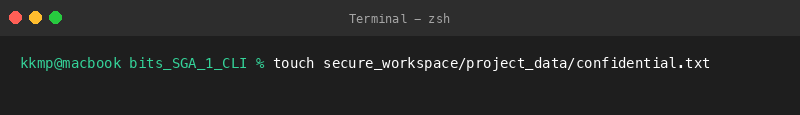
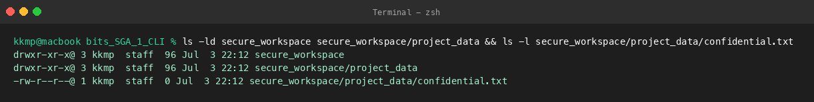
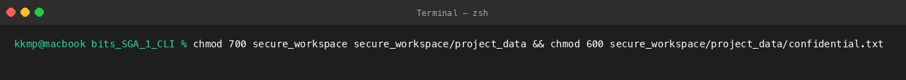
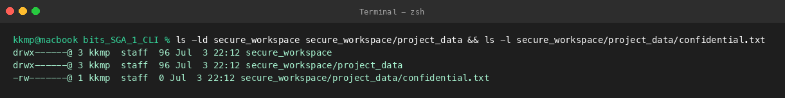

# Question 2: Secure Project Workspace Setup

This directory contains the verification steps for setting up a secure workspace, modifying folder/file permissions, and analyzing the system umask.

## Files Created
- [Project_Workspace_Report.txt](file:///Users/kkmp/Desktop/bits/bits_SGA_1_CLI/Question_2/Project_Workspace_Report.txt): Summary of the folder layout, default/updated permissions, umask, and how the changes secure the data.

---

## Executed Commands, Outputs, and Explanations

### 1. View System Umask (`umask`)
**Command:**
```bash
umask
```

**Output:**
```text
0022
```

**Explanation:**
Checked the current shell's file creation mask. Got `0022`, which limits group and other users' write access on new files.

**Screenshot:**


---

### 2. Create Workspace Directory (`mkdir -p secure_workspace/project_data`)
**Command:**
```bash
mkdir -p secure_workspace/project_data
```

**Output:**
```text
(Silent execution, no stdout output)
```

**Explanation:**
Created the project folder structure recursively. The command executed silently, which means it was successful.

**Screenshot:**


---

### 3. Create Confidential File (`touch secure_workspace/project_data/confidential.txt`)
**Command:**
```bash
touch secure_workspace/project_data/confidential.txt
```

**Output:**
```text
(Silent execution, no stdout output)
```

**Explanation:**
Created an empty file named `confidential.txt` inside the new folder. The file was created with no issues.

**Screenshot:**


---

### 4. Check Initial Permissions (`ls -ld ... && ls -l ...`)
**Command:**
```bash
ls -ld secure_workspace secure_workspace/project_data && ls -l secure_workspace/project_data/confidential.txt
```

**Output:**
```text
drwxr-xr-x@ 3 kkmp  staff  96 Jul  3 22:12 secure_workspace
drwxr-xr-x@ 3 kkmp  staff  96 Jul  3 22:12 secure_workspace/project_data
-rw-r--r--@ 1 kkmp  staff  0 Jul  3 22:12 secure_workspace/project_data/confidential.txt
```

**Explanation:**
Checked the default permissions. The directories were set to 755 (`drwxr-xr-x`) and the file to 644 (`-rw-r--r--`), matching the umask.

**Screenshot:**


---

### 5. Modify Permissions (`chmod 700 ... && chmod 600 ...`)
**Command:**
```bash
chmod 700 secure_workspace secure_workspace/project_data && chmod 600 secure_workspace/project_data/confidential.txt
```

**Output:**
```text
(Silent execution, no stdout output)
```

**Explanation:**
Modified the permissions to secure the workspace. Set directories to 700 and the confidential file to 600.

**Screenshot:**


---

### 6. Verify Updated Permissions (`ls -ld ... && ls -l ...`)
**Command:**
```bash
ls -ld secure_workspace secure_workspace/project_data && ls -l secure_workspace/project_data/confidential.txt
```

**Output:**
```text
drwx------@ 3 kkmp  staff  96 Jul  3 22:12 secure_workspace
drwx------@ 3 kkmp  staff  96 Jul  3 22:12 secure_workspace/project_data
-rw-------@ 1 kkmp  staff  0 Jul  3 22:12 secure_workspace/project_data/confidential.txt
```

**Explanation:**
Verified that the permissions updated correctly. The directories now show `drwx------` and the file shows `-rw-------`, meaning only my user has access.

**Screenshot:**

