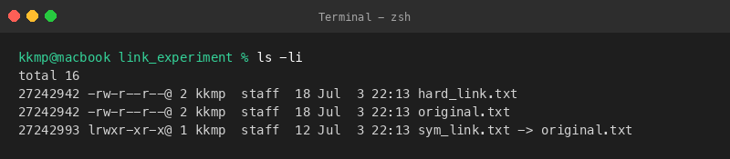
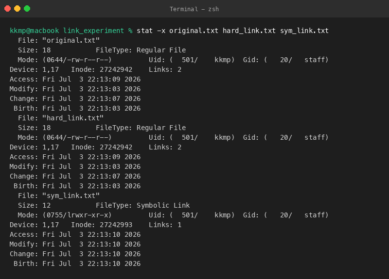
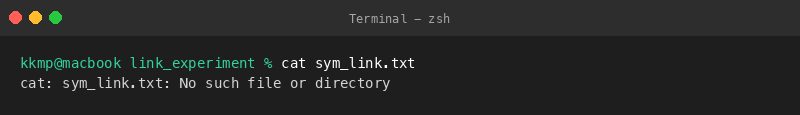
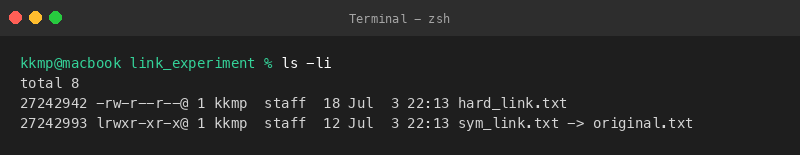

# Question 3: File System and Link Analysis

This directory contains the commands and reports showing how hard links and symbolic links behave when you delete the original file.

## Files Created
- [Link_Analysis_Report.txt](file:///Users/kkmp/Desktop/bits/bits_SGA_1_CLI/Question_3/Link_Analysis_Report.txt): Detail comparison of the links, inode analysis, and conclusions.
- `link_experiment/`: Folder where the link operations were executed.

---

## Executed Commands, Outputs, and Explanations

### 1. Create Base File (`echo ... > original.txt`)
**Command:**
```bash
echo "Hello Linux Links" > original.txt
```

**Output:**
```text
(Silent execution, no stdout output)
```

**Explanation:**
Created the source file `original.txt` with some test text to act as the link target.

**Screenshot:**


---

### 2. Create Hard Link (`ln original.txt hard_link.txt`)
**Command:**
```bash
ln original.txt hard_link.txt
```

**Output:**
```text
(Silent execution, no stdout output)
```

**Explanation:**
Created a hard link pointing to the original file. The command completed silently.

**Screenshot:**


---

### 3. Create Symbolic Link (`ln -s original.txt sym_link.txt`)
**Command:**
```bash
ln -s original.txt sym_link.txt
```

**Output:**
```text
(Silent execution, no stdout output)
```

**Explanation:**
Created a symbolic link pointing to the original file. This creates a shortcut to its file path.

**Screenshot:**


---

### 4. Check Inodes (`ls -li`)
**Command:**
```bash
ls -li
```

**Output:**
```text
total 16
27242942 -rw-r--r--@ 2 kkmp  staff  18 Jul  3 22:13 hard_link.txt
27242942 -rw-r--r--@ 2 kkmp  staff  18 Jul  3 22:13 original.txt
27242993 lrwxr-xr-x@ 1 kkmp  staff  12 Jul  3 22:13 sym_link.txt -> original.txt
```

**Explanation:**
Checked the inode numbers. The original file and hard link share the exact same inode `27242942`, while the symlink has its own inode `27242993`.

**Screenshot:**


---

### 5. Check Detailed Metadata (`stat -x ...`)
**Command:**
```bash
stat -x original.txt hard_link.txt sym_link.txt
```

**Output:**
```text
  File: "original.txt"
  Size: 18           FileType: Regular File
  Mode: (0644/-rw-r--r--)         Uid: (  501/    kkmp)  Gid: (   20/   staff)
Device: 1,17   Inode: 27242942    Links: 2
Access: Fri Jul  3 22:13:09 2026
Modify: Fri Jul  3 22:13:03 2026
Change: Fri Jul  3 22:13:07 2026
 Birth: Fri Jul  3 22:13:03 2026
  File: "hard_link.txt"
  Size: 18           FileType: Regular File
  Mode: (0644/-rw-r--r--)         Uid: (  501/    kkmp)  Gid: (   20/   staff)
Device: 1,17   Inode: 27242942    Links: 2
Access: Fri Jul  3 22:13:09 2026
Modify: Fri Jul  3 22:13:03 2026
Change: Fri Jul  3 22:13:07 2026
 Birth: Fri Jul  3 22:13:03 2026
  File: "sym_link.txt"
  Size: 12           FileType: Symbolic Link
  Mode: (0755/lrwxr-xr-x)         Uid: (  501/    kkmp)  Gid: (   20/   staff)
Device: 1,17   Inode: 27242993    Links: 1
Access: Fri Jul  3 22:13:10 2026
Modify: Fri Jul  3 22:13:10 2026
Change: Fri Jul  3 22:13:10 2026
 Birth: Fri Jul  3 22:13:10 2026
```

**Explanation:**
Ran `stat` to check the file metadata. It confirms that the hard link shares the inode and link count of the original, while the symlink is a separate link file.

**Screenshot:**


---

### 6. Remove Original File (`rm original.txt`)
**Command:**
```bash
rm original.txt
```

**Output:**
```text
(Silent execution, no stdout output)
```

**Explanation:**
Removed the original file to test what happens to the links.

**Screenshot:**


---

### 7. Check Hard Link Content (`cat hard_link.txt`)
**Command:**
```bash
cat hard_link.txt
```

**Output:**
```text
Hello Linux Links
```

**Explanation:**
Read the hard link after deleting the source. The file content is still readable because the inode reference persists.

**Screenshot:**


---

### 8. Check Symbolic Link Content (`cat sym_link.txt`)
**Command:**
```bash
cat sym_link.txt
```

**Output:**
```text
cat: sym_link.txt: No such file or directory
```

**Explanation:**
Tried reading the symlink. It failed with a 'No such file or directory' error because the target file path no longer exists.

**Screenshot:**


---

### 9. Verify Final Inodes (`ls -li`)
**Command:**
```bash
ls -li
```

**Output:**
```text
total 8
27242942 -rw-r--r--@ 1 kkmp  staff  18 Jul  3 22:13 hard_link.txt
27242993 lrwxr-xr-x@ 1 kkmp  staff  12 Jul  3 22:13 sym_link.txt -> original.txt
```

**Explanation:**
Checked the final inodes. The hard link's link count has dropped to 1, and the symlink is now highlighted as a broken link.

**Screenshot:**

