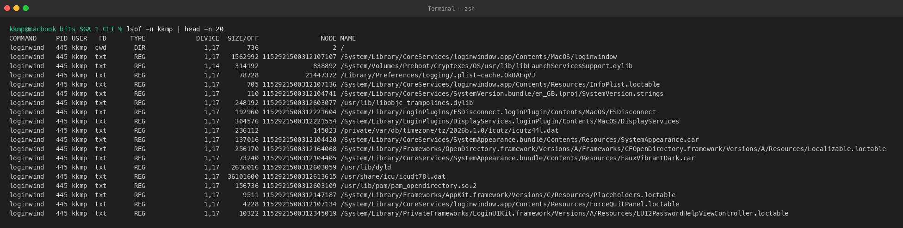
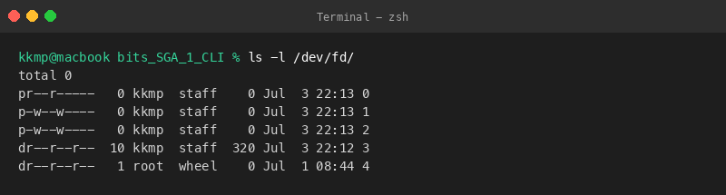
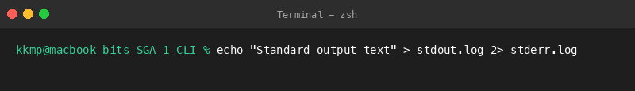
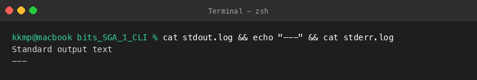
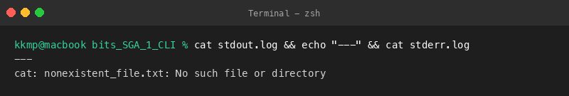
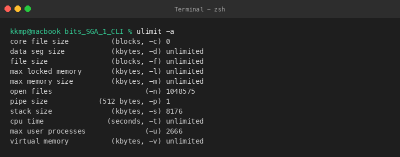

# Question 4: File Access and I/O Investigation

This directory contains command outputs and reports investigating open system files, process file descriptors, standard/error redirection, and shell limits.

## Files Created
- [IO_Investigation_Report.txt](file:///Users/kkmp/Desktop/bits/bits_SGA_1_CLI/Question_4/IO_Investigation_Report.txt): Summary of open files, file descriptor streams, redirection logs, and ulimit parameters.
- [stdout.log](file:///Users/kkmp/Desktop/bits/bits_SGA_1_CLI/Question_4/stdout.log): Captures stdout stream redirect.
- [stderr.log](file:///Users/kkmp/Desktop/bits/bits_SGA_1_CLI/Question_4/stderr.log): Captures stderr stream redirect.

---

## Executed Commands, Outputs, and Explanations

### 1. View Open Files (`lsof -u kkmp | head -n 20`)
**Command:**
```bash
lsof -u kkmp | head -n 20
```

**Output:**
```text
COMMAND     PID USER   FD      TYPE             DEVICE  SIZE/OFF                NODE NAME
loginwind   445 kkmp  cwd       DIR               1,17       736                   2 /
loginwind   445 kkmp  txt       REG               1,17   1562992 1152921500312107107 /System/Library/CoreServices/loginwindow.app/Contents/MacOS/loginwindow
loginwind   445 kkmp  txt       REG               1,14    314192              838892 /System/Volumes/Preboot/Cryptexes/OS/usr/lib/libLaunchServicesSupport.dylib
loginwind   445 kkmp  txt       REG               1,17     78728            21447372 /Library/Preferences/Logging/.plist-cache.OkOAFqVJ
loginwind   445 kkmp  txt       REG               1,17       705 1152921500312107136 /System/Library/CoreServices/loginwindow.app/Contents/Resources/InfoPlist.loctable
loginwind   445 kkmp  txt       REG               1,17       110 1152921500312104741 /System/Library/CoreServices/SystemVersion.bundle/en_GB.lproj/SystemVersion.strings
loginwind   445 kkmp  txt       REG               1,17    248192 1152921500312603077 /usr/lib/libobjc-trampolines.dylib
loginwind   445 kkmp  txt       REG               1,17    192960 1152921500312221604 /System/Library/LoginPlugins/FSDisconnect.loginPlugin/Contents/MacOS/FSDisconnect
loginwind   445 kkmp  txt       REG               1,17    304576 1152921500312221554 /System/Library/LoginPlugins/DisplayServices.loginPlugin/Contents/MacOS/DisplayServices
loginwind   445 kkmp  txt       REG               1,17    236112              145023 /private/var/db/timezone/tz/2026b.1.0/icutz/icutz44l.dat
loginwind   445 kkmp  txt       REG               1,17    137016 1152921500312104420 /System/Library/CoreServices/SystemAppearance.bundle/Contents/Resources/SystemAppearance.car
loginwind   445 kkmp  txt       REG               1,17    256170 1152921500312164068 /System/Library/Frameworks/OpenDirectory.framework/Versions/A/Frameworks/CFOpenDirectory.framework/Versions/A/Resources/Localizable.loctable
loginwind   445 kkmp  txt       REG               1,17     73240 1152921500312104405 /System/Library/CoreServices/SystemAppearance.bundle/Contents/Resources/FauxVibrantDark.car
loginwind   445 kkmp  txt       REG               1,17   2636016 1152921500312603059 /usr/lib/dyld
loginwind   445 kkmp  txt       REG               1,17  36101600 1152921500312613615 /usr/share/icu/icudt78l.dat
loginwind   445 kkmp  txt       REG               1,17    156736 1152921500312603109 /usr/lib/pam/pam_opendirectory.so.2
loginwind   445 kkmp  txt       REG               1,17      9511 1152921500312147187 /System/Library/Frameworks/AppKit.framework/Versions/C/Resources/Placeholders.loctable
loginwind   445 kkmp  txt       REG               1,17      4228 1152921500312107134 /System/Library/CoreServices/loginwindow.app/Contents/Resources/ForceQuitPanel.loctable
loginwind   445 kkmp  txt       REG               1,17     10322 1152921500312345019 /System/Library/PrivateFrameworks/LoginUIKit.framework/Versions/A/Resources/LUI2PasswordHelpViewController.loctable
```

**Explanation:**
Ran `lsof` to list open files for my user account, limiting the output to the first 20 lines to keep it readable.

**Screenshot:**


---

### 2. View Active File Descriptors (`ls -l /dev/fd/`)
**Command:**
```bash
ls -l /dev/fd/
```

**Output:**
```text
total 0
pr--r-----   0 kkmp  staff    0 Jul  3 22:13 0
p-w--w----   0 kkmp  staff    0 Jul  3 22:13 1
p-w--w----   0 kkmp  staff    0 Jul  3 22:13 2
dr--r--r--  10 kkmp  staff  320 Jul  3 22:12 3
dr--r--r--   1 root  wheel    0 Jul  1 08:44 4
```

**Explanation:**
Inspected the `/dev/fd` directory to view the file descriptors mapped to the active terminal session.

**Screenshot:**


---

### 3. Redirect Standard Output (`echo ... > stdout.log 2> stderr.log`)
**Command:**
```bash
echo "Standard output text" > stdout.log 2> stderr.log
```

**Output:**
```text
(Silent execution, no stdout output)
```

**Explanation:**
Redirected stdout to `stdout.log` and stderr to `stderr.log` using a normal echo command. The logs captured standard output as expected.

**Screenshot:**


---

### 4. Verify Success Logs (`cat stdout.log ...`)
**Command:**
```bash
cat stdout.log && echo "---" && cat stderr.log
```

**Output:**
```text
Standard output text
---
```

**Explanation:**
Verified the files. `stdout.log` contains the text while `stderr.log` is empty since there were no errors.

**Screenshot:**


---

### 5. Redirect Standard Error (`cat nonexistent_file.txt > stdout.log 2> stderr.log`)
**Command:**
```bash
cat nonexistent_file.txt > stdout.log 2> stderr.log
```

**Output:**
```text
(Silent execution, no stdout output)
```

**Explanation:**
Ran a command that fails to test error redirection. Standard error successfully captured the error message.

**Screenshot:**


---

### 6. Verify Error Logs (`cat stdout.log ...`)
**Command:**
```bash
cat stdout.log && echo "---" && cat stderr.log
```

**Output:**
```text
---
cat: nonexistent_file.txt: No such file or directory
```

**Explanation:**
Verified the files again. The error log contains the failure message, and the stdout log is now empty because it was truncated.

**Screenshot:**


---

### 7. View Shell Resource Limits (`ulimit -a`)
**Command:**
```bash
ulimit -a
```

**Output:**
```text
core file size          (blocks, -c) 0
data seg size           (kbytes, -d) unlimited
file size               (blocks, -f) unlimited
max locked memory       (kbytes, -l) unlimited
max memory size         (kbytes, -m) unlimited
open files                      (-n) 1048575
pipe size            (512 bytes, -p) 1
stack size              (kbytes, -s) 8176
cpu time               (seconds, -t) unlimited
max user processes              (-u) 2666
virtual memory          (kbytes, -v) unlimited
```

**Explanation:**
Printed the process limits for my shell environment. This lists constraints on open files, processes, and memory.

**Screenshot:**

