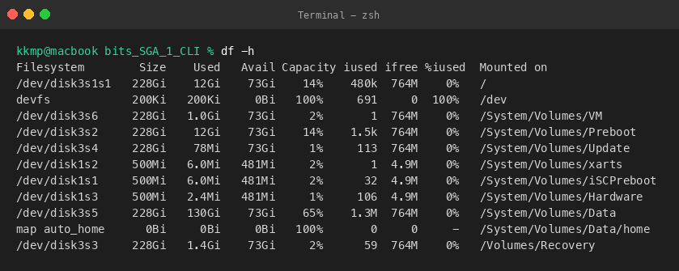
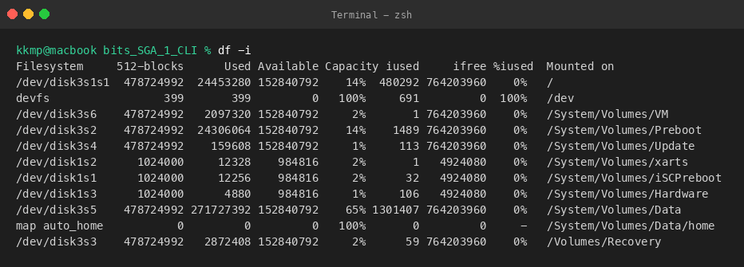
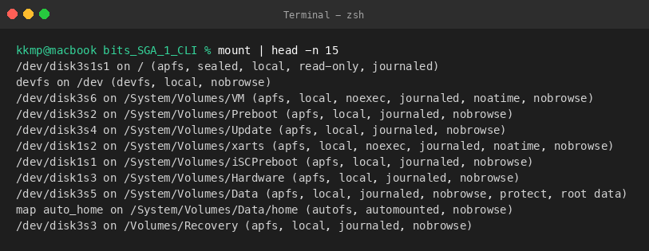
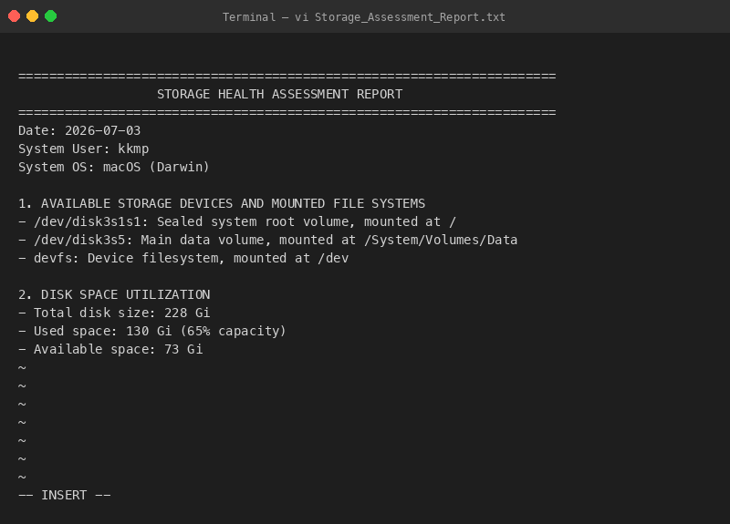
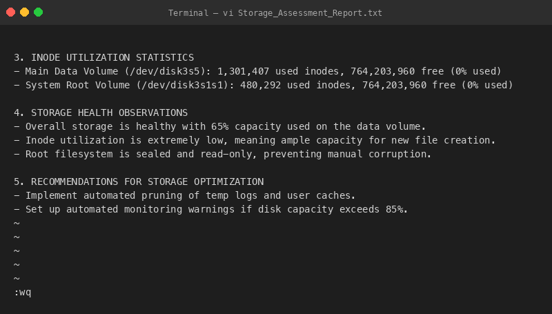

# Question 5: Storage Health Assessment and Documentation

This directory contains command outputs and reports checking system storage health, mount configurations, and creating a report using the `vi` text editor.

## Files Created
- [Storage_Assessment_Report.txt](file:///Users/kkmp/Desktop/bits/bits_SGA_1_CLI/Question_5/Storage_Assessment_Report.txt): Detail report containing storage stats, inode capacity, and optimization suggestions, written using the `vi` editor.

---

## Executed Commands, Outputs, and Explanations

### 1. View Disk Space Usage (`df -h`)
**Command:**
```bash
df -h
```

**Output:**
```text
Filesystem        Size    Used   Avail Capacity iused ifree %iused  Mounted on
/dev/disk3s1s1   228Gi    12Gi    73Gi    14%    480k  764M    0%   /
devfs            200Ki   200Ki     0Bi   100%     691     0  100%   /dev
/dev/disk3s6     228Gi   1.0Gi    73Gi     2%       1  764M    0%   /System/Volumes/VM
/dev/disk3s2     228Gi    12Gi    73Gi    14%    1.5k  764M    0%   /System/Volumes/Preboot
/dev/disk3s4     228Gi    78Mi    73Gi     1%     113  764M    0%   /System/Volumes/Update
/dev/disk1s2     500Mi   6.0Mi   481Mi     2%       1  4.9M    0%   /System/Volumes/xarts
/dev/disk1s1     500Mi   6.0Mi   481Mi     2%      32  4.9M    0%   /System/Volumes/iSCPreboot
/dev/disk1s3     500Mi   2.4Mi   481Mi     1%     106  4.9M    0%   /System/Volumes/Hardware
/dev/disk3s5     228Gi   130Gi    73Gi    65%    1.3M  764M    0%   /System/Volumes/Data
map auto_home      0Bi     0Bi     0Bi   100%       0     0     -   /System/Volumes/Data/home
/dev/disk3s3     228Gi   1.4Gi    73Gi     2%      59  764M    0%   /Volumes/Recovery
```

**Explanation:**
Ran `df -h` to check disk space usage in human-readable gigabytes. Shows 65% capacity used on my main data drive.

**Screenshot:**


---

### 2. View Inode Utilization (`df -i`)
**Command:**
```bash
df -i
```

**Output:**
```text
Filesystem     512-blocks      Used Available Capacity iused     ifree %iused  Mounted on
/dev/disk3s1s1  478724992  24453280 152840792    14%  480292 764203960    0%   /
devfs                 399       399         0   100%     691         0  100%   /dev
/dev/disk3s6    478724992   2097320 152840792     2%       1 764203960    0%   /System/Volumes/VM
/dev/disk3s2    478724992  24306064 152840792    14%    1489 764203960    0%   /System/Volumes/Preboot
/dev/disk3s4    478724992    159608 152840792     1%     113 764203960    0%   /System/Volumes/Update
/dev/disk1s2      1024000     12328    984816     2%       1   4924080    0%   /System/Volumes/xarts
/dev/disk1s1      1024000     12256    984816     2%      32   4924080    0%   /System/Volumes/iSCPreboot
/dev/disk1s3      1024000      4880    984816     1%     106   4924080    0%   /System/Volumes/Hardware
/dev/disk3s5    478724992 271727392 152840792    65% 1301407 764203960    0%   /System/Volumes/Data
map auto_home           0         0         0   100%       0         0     -   /System/Volumes/Data/home
/dev/disk3s3    478724992   2872408 152840792     2%      59 764203960    0%   /Volumes/Recovery
```

**Explanation:**
Checked inode allocation using `df -i`. Usage is at 0% since APFS allocates inodes dynamically.

**Screenshot:**


---

### 3. View Mounted Filesystems (`mount`)
**Command:**
```bash
mount | head -n 15
```

**Output:**
```text
/dev/disk3s1s1 on / (apfs, sealed, local, read-only, journaled)
devfs on /dev (devfs, local, nobrowse)
/dev/disk3s6 on /System/Volumes/VM (apfs, local, noexec, journaled, noatime, nobrowse)
/dev/disk3s2 on /System/Volumes/Preboot (apfs, local, journaled, nobrowse)
/dev/disk3s4 on /System/Volumes/Update (apfs, local, journaled, nobrowse)
/dev/disk1s2 on /System/Volumes/xarts (apfs, local, noexec, journaled, noatime, nobrowse)
/dev/disk1s1 on /System/Volumes/iSCPreboot (apfs, local, journaled, nobrowse)
/dev/disk1s3 on /System/Volumes/Hardware (apfs, local, journaled, nobrowse)
/dev/disk3s5 on /System/Volumes/Data (apfs, local, journaled, nobrowse, protect, root data)
map auto_home on /System/Volumes/Data/home (autofs, automounted, nobrowse)
/dev/disk3s3 on /Volumes/Recovery (apfs, local, journaled, nobrowse)
```

**Explanation:**
Listed all active filesystem mounts, showing how partitions like the system root and swap are mounted.

**Screenshot:**


---

### 4. Create Report Using vi (`vi Storage_Assessment_Report.txt`)
**Command:**
```bash
vi Storage_Assessment_Report.txt
```

**Explanation:**
Opened the vi editor in terminal to create the Storage Assessment Report file.

**Screenshot:**


---

### 5. Editing in vi (Insert Mode)
**Action:**
Switched to edit mode (pressed `i` key) and entered the report text.

**Screenshot:**


---

### 6. Save and Exit (`:wq`)
**Action:**
Saved and closed the file using the vi command `:wq`.

**Screenshot:**

